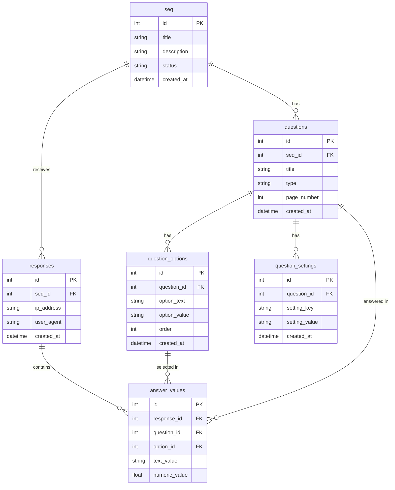

## Relationship Diagram


## STEP

```bash
mvn clean install
```
```bash
mvn spring-boot:run
```

#### When your follow top step Open http://localhost:3100/api/swagger-ui/index.html with your browser to see Doc-apis with swagger and http://localhost:3100/api/h2-console/ for h2database.

## docker-compose

```bash
docker compose up -d --build
```